# Database Structure

The Neo4j database used for the sensor dashboard has the following structure:

```mermaid
graph TD
    SR[SensorReading] -->|HAS_TEMPERATURE_CLASS| CH[Classification: High]
    SR -->|HAS_TEMPERATURE_CLASS| CM[Classification: Medium]
    SR -->|HAS_TEMPERATURE_CLASS| CL[Classification: Low]
    
    SR -->|HAS_HUMIDITY_CLASS| CH
    SR -->|HAS_HUMIDITY_CLASS| CM
    SR -->|HAS_HUMIDITY_CLASS| CL
    
    SR -->|HAS_GAS_CLASS| CH
    SR -->|HAS_GAS_CLASS| CM
    SR -->|HAS_GAS_CLASS| CL
    
    SR -->|BELONGS_TO_TIME_GROUP| TE[TimeGroup: Early Readings]
    SR -->|BELONGS_TO_TIME_GROUP| TM[TimeGroup: Middle Readings]
    SR -->|BELONGS_TO_TIME_GROUP| TL[TimeGroup: Late Readings]
    
    subgraph SensorReading Properties
        SR1[temperature]
        SR2[humidity]
        SR3[pressure]
        SR4[timestamp]
        
        SR --- SR1
        SR --- SR2
        SR --- SR3
        SR --- SR4
    end
```

## Node Types

1. **SensorReading** (352 nodes):
   - Contains environmental data with properties:
     - temperature
     - humidity
     - pressure
     - timestamp

2. **Classification** (3 nodes):
   - Represents classification levels:
     - High
     - Medium
     - Low

3. **TimeGroup** (3 nodes):
   - Groups readings by time period:
     - Early Readings
     - Middle Readings
     - Late Readings

## Relationships

1. **HAS_TEMPERATURE_CLASS** (327 relationships):
   - Connects SensorReading → Classification
   - Classifies readings by temperature level

2. **HAS_HUMIDITY_CLASS** (327 relationships):
   - Connects SensorReading → Classification
   - Classifies readings by humidity level

3. **HAS_GAS_CLASS** (323 relationships):
   - Connects SensorReading → Classification
   - Classifies readings by gas level

4. **BELONGS_TO_TIME_GROUP** (327 relationships):
   - Connects SensorReading → TimeGroup
   - Groups sensor readings by time period